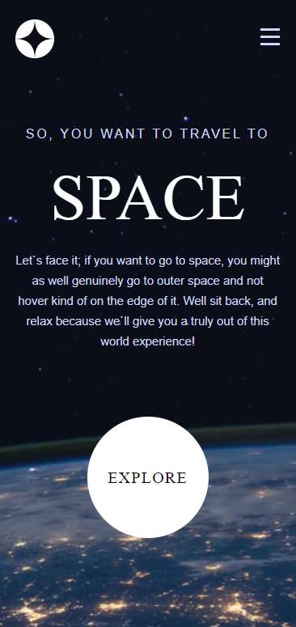
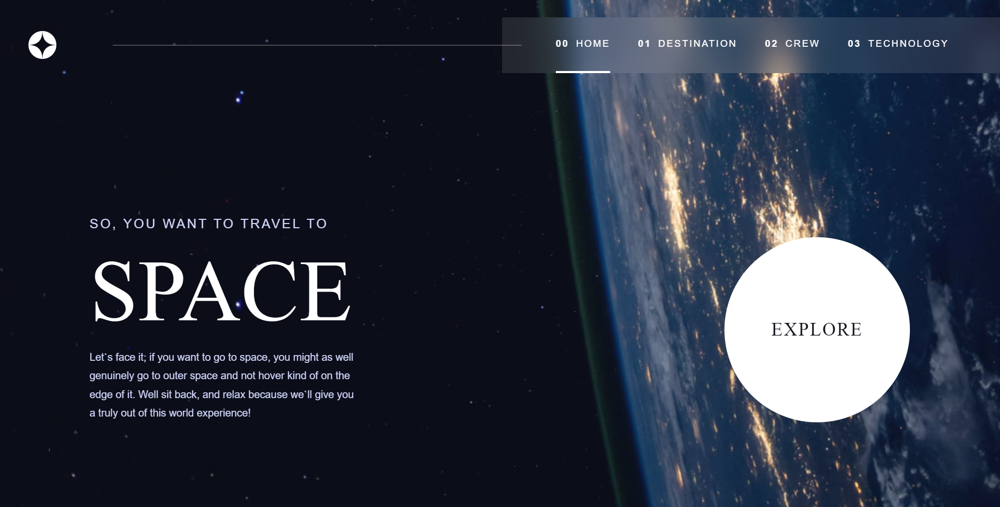

# Frontend Mentor - Space tourism website

## Table of contents

- [Screenshot](#screenshot) 
- [The challenge](#the-challenge)
- [Links](#links)
- [Author](#author)
### Screenshot

<table>
        <tr>
            <td>
                
            </td>
            <td>
                
            </td>
        </tr>
</table>

## The challenge

Your users should be able to:

- View the optimal layout for each of the website's pages depending on their device's screen size
- See hover states for all interactive elements on the page
- View each page and be able to toggle between the tabs to see new information

### Links

- Solution URL: [https://www.frontendmentor.io/solutions/responsive-space-tourism-website-with-next-and-tailwind-Ir9FF_0xI2](https://www.frontendmentor.io/solutions/responsive-space-tourism-website-with-next-and-tailwind-Ir9FF_0xI2)
- Live Site URL: [https://space-tourism-y0s6p96pa-squashim.vercel.app/](https://space-tourism-y0s6p96pa-squashim.vercel.app/)

## Author

- Website - [@Squashim](https://github.com/Squashim)
- Frontend Mentor - [@Squashim](https://www.frontendmentor.io/profile/Squashim)

**Have fun building!** 🚀
